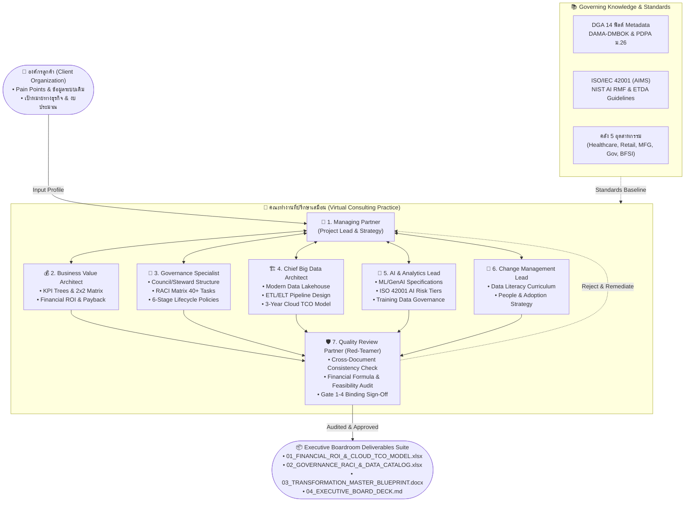
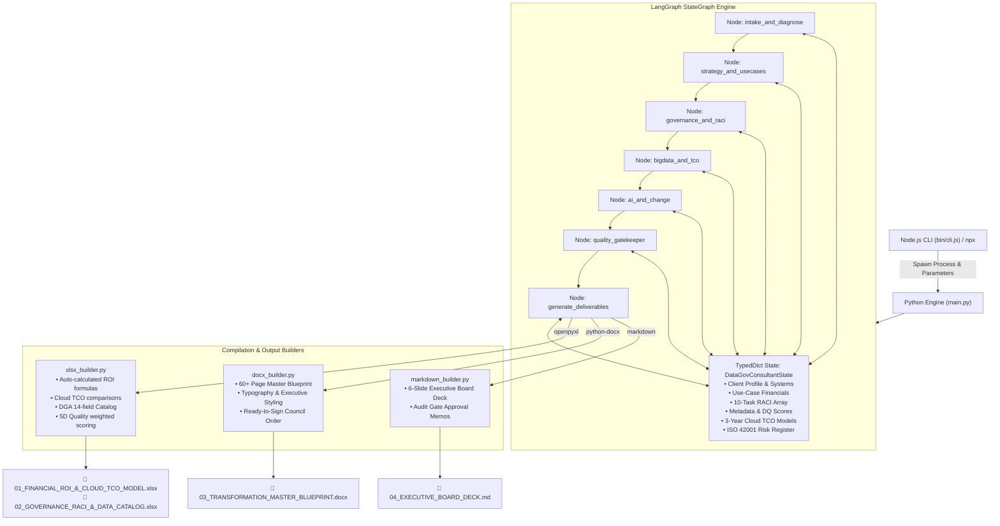
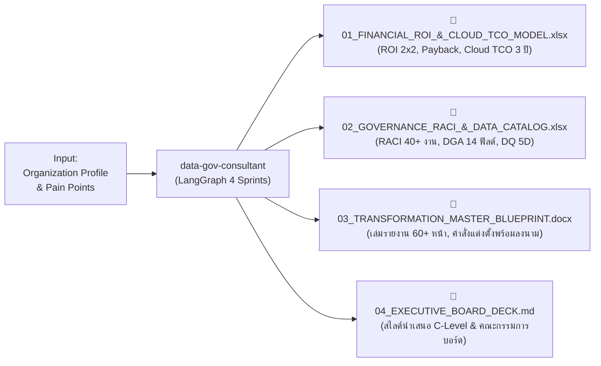

# 🏛️ data-gov-consultant
### AI-Native Big Data, Data Governance & AI Transformation Consulting Engine

`data-gov-consultant` คือแพลตฟอร์มที่ปรึกษาเสมือนจริง (Virtual Consulting Practice) ที่ออกแบบมาเพื่อทดแทนและยกระดับงานบริการของบริษัทที่ปรึกษาด้าน Big Data และ Data Governance ชั้นนำ (เช่น Coraline) โดยเปลี่ยนกระบวนการที่เคยใช้เวลา 3–6 เดือนและงบประมาณหลายล้านบาท ให้สำเร็จได้ใน **3–5 วัน** ผ่านคณะทำงาน Multi-Agent 7 บทบาท บนสถาปัตยกรรม **LangGraph State Machine**

---

## 🏛️ สถาปัตยกรรมระบบ Agent (Agent Architecture & Workflow)

ระบบ `data-gov-consultant` ทำงานผ่าน 3 ชั้นสถาปัตยกรรมหลัก: **(1) Multi-Agent Consulting Ensemble**, **(2) The 4-Sprint Stage-Gated Assembly Line**, และ **(3) Document Compilation Engine**:

### 1. โครงสร้างและการสื่อสารของทีม Agent 7 บทบาท (Multi-Agent Topology)



---

### 2. กระบวนการ 4-Sprint Stage-Gated Assembly Line & The Bridge Gate

```mermaid
stateDiagram-v2
    [*] --> Sprint1_BusinessStrategy : Onboarding

    state Sprint1_BusinessStrategy {
        [*] --> DiscoverPainPoints
        DiscoverPainPoints --> BuildKPITree
        BuildKPITree --> Prioritize2x2Matrix
        Prioritize2x2Matrix --> CalculateFinancialROI
        CalculateFinancialROI --> Gate1_Check
    }

    Gate1_Check --> Sprint2_DataGovernance : Gate 1 Passed (Sponsor Approval)
    Gate1_Check --> Sprint1_BusinessStrategy : Revise ROI Assumptions

    state Sprint2_DataGovernance {
        [*] --> DesignCouncilAndStewards
        DesignCouncilAndStewards --> ConstructRACIMatrix
        ConstructRACIMatrix --> Draft6StagePolicies
        Draft6StagePolicies --> EnforcePDPASecurity
        EnforcePDPASecurity --> Gate2_Check
    }

    Gate2_Check --> Sprint3_BigDataArchitecture : Gate 2 Passed (Council Formalized)
    Gate2_Check --> Sprint2_DataGovernance : Refine Roles & Approvals

    state Sprint3_BigDataArchitecture {
        [*] --> DesignLakehouseTopology
        DesignLakehouseTopology --> BlueprintETLPipelines
        BlueprintETLPipelines --> CatalogHighValueData_14Fields
        CatalogHighValueData_14Fields --> BenchmarkCloudTCO_3Years
        BenchmarkCloudTCO_3Years --> AuditDataQuality_5Dimensions
        AuditDataQuality_5Dimensions --> Bridge_Gate_3
    }

    Bridge_Gate_3 --> Sprint4_AITransformation : Gate 3 Passed (DQ >= 80% & Data Classified)
    Bridge_Gate_3 --> Sprint3_BigDataArchitecture : Cleanse & Fix Nulls/Formats

    state Sprint4_AITransformation {
        [*] --> InventoryAISystems
        InventoryAISystems --> TierAIRisks_ISO42001
        TierAIRisks_ISO42001 --> DeIdentifyTrainingData
        DeIdentifyTrainingData --> DraftDataLiteracyCurriculum
        DraftDataLiteracyCurriculum --> Gate4_FinalAudit
    }

    Gate4_FinalAudit --> BuildDeliverablesPackage : Gate 4 Passed (100% Quality Pass)
    BuildDeliverablesPackage --> [*] : Turnkey Boardroom Package Delivered
```



---

### 3. สถาปัตยกรรมทางเทคนิคของระบบ (LangGraph Execution & Document Engine)



---

## 📦 1. วิธีติดตั้งและใช้งานผ่าน Node Package

ระบบรองรับการเรียกใช้งานผ่าน Node.js CLI และ npm ecosystem ทำให้สามารถเรียกใช้งานผ่านคำสั่งเดียวได้ทันที

### วิธีที่ 1: รันผ่าน `npx` (ไม่ต้องติดตั้งล่วงหน้า)
```bash
# รันการให้คำปรึกษาด้วยค่าเริ่มต้น
npx data-gov-consultant run

# รันสำหรับองค์กรเฉพาะทาง (ระบุชื่อ อุตสาหกรรม และงบประมาณ)
npx data-gov-consultant run --name "โรงพยาบาลธนบุรีสมาร์ทแคร์" --industry healthcare --budget 1500000000
```

### วิธีที่ 2: ติดตั้งแบบ Global ผ่าน `npm`
```bash
npm install -g data-gov-consultant

# ตรวจสอบคำสั่งทั้งหมด
data-gov-consultant --help

# ดูคลังอุตสาหกรรมสำเร็จรูปทั้ง 5 กลุ่ม
data-gov-consultant list-industries
```

### วิธีที่ 3: ติดตั้งใช้งานใน Local Repository (สำหรับ Developer)
```bash
# 1. เข้าสู่โฟลเดอร์โปรเจกต์
cd /Users/tonkla/.gemini/antigravity/scratch/data-gov-consultant

# 2. ติดตั้ง Python Virtual Environment และ Dependencies
uv venv --python /Users/tonkla/.local/bin/python3.11 .venv
uv pip install --python .venv/bin/python python-docx openpyxl pydantic langgraph langchain-core

# 3. รันระบบผ่าน Node CLI
node bin/cli.js run
```

---

## 🤖 2. คู่มือการใช้งานผ่าน AI Coding Agents ทีละขั้นตอน

คุณสามารถใช้งาน `data-gov-consultant` ร่วมกับ AI Developer Agents ยอดนิยม เช่น **Claude Code**, **OpenAI Codex / GitHub Copilot CLI**, และ **Antigravity / Cursor** เพื่อให้ AI รับบทบาทเป็น Managing Partner คอยนำพาทีมวิเคราะห์และปรับแต่งเอกสารส่งมอบอัตโนมัติ

---

### 🟣 การใช้งานผ่าน Claude Code (`claude`)

**Claude Code** จาก Anthropic คือ Agent CLI ที่ทำงานบน Terminal โดยตรง เหมาะสำหรับการสั่งรันสปรินต์ที่ปรึกษาและปรับแต่งรายงานเชิงลึก

#### ขั้นตอนที่ 1: เปิดใช้งาน Claude Code ในโฟลเดอร์โปรเจกต์
```bash
cd /Users/tonkla/.gemini/antigravity/scratch/data-gov-consultant
claude
```

#### ขั้นตอนที่ 2: ใช้ Prompt สั่งให้ Claude Code ดำเนินการ Onboarding ลูกค้าใหม่
คัดลอก Prompt ด้านล่างนี้ส่งให้ Claude Code:
```text
ทำหน้าที่เป็น Lead Transformation Partner สำหรับ data-gov-consultant 
ฉันต้องการเริ่มโปรเจกต์ที่ปรึกษาให้กับลูกค้าใหม่:
- ชื่อองค์กร: บริษัท สยามโลจิสติกส์ โซลูชันส์ จำกัด (มหาชน)
- อุตสาหกรรม: manufacturing (โลจิสติกส์และห่วงโซ่อุปทาน)
- ปัญหาหลัก: ต้นทุนเชื้อเพลิงสูง, ข้อมูลติดตามรถบรรทุกและคลังสินค้าแยกส่วนกัน, รายงานสิ้นเดือนใช้เวลาทำ 10 วัน

ช่วยรันคำสั่ง node bin/cli.js run เพื่อสร้างชุด Deliverables ทั้งหมด แล้วเปิดดูไฟล์ที่สร้างขึ้นมาใน output/ เพื่อสรุปประเด็นทางการเงินให้ฉันฟัง
```

#### ขั้นตอนที่ 3: สั่งให้ Claude Code ตรวจสอบและปรับปรุงเอกสารเฉพาะจุด
```text
ช่วยตรวจสอบไฟล์ output/03_TRANSFORMATION_MASTER_BLUEPRINT.docx 
และปรับปรุงมาตรการรักษาความปลอดภัยของข้อมูล GPS และคนขับรถ ให้สอดคล้องกับ PDPA มาตรา 24 และ 26 
พร้อมทั้งเขียนสเปกของโมเดล AI Route Optimization เพิ่มลงไปในเล่มรายงาน
```

---

### 🟢 การใช้งานผ่าน GitHub Copilot CLI / Codex Agent (`gh copilot`)

สำหรับผู้ใช้งาน **GitHub Copilot CLI** หรือ **OpenAI Codex Agents** สามารถสั่งการให้ AI สร้างคลัง Use Cases และคำนวณโมเดลทางการเงินใหม่ได้ทันที

#### ขั้นตอนที่ 1: เรียกใช้ Copilot เพื่อตรวจสอบโครงสร้างคำสั่ง
```bash
gh copilot suggest "how to run data-gov-consultant for a banking client with 5 billion baht budget"
```

#### ขั้นตอนที่ 2: สั่งให้ Codex พัฒนา Industry Accelerator ใหม่
ส่งคำสั่งให้ Codex Agent ใน IDE หรือ Terminal:
```text
ช่วยเพิ่มคลัง Use Cases สำหรับอุตสาหกรรม "real_estate" (อสังหาริมทรัพย์) ลงใน config/knowledge_base.py
โดยต้องมี:
1. Regulatory drivers: พ.ร.บ. อาคารชุด, PDPA ข้อมูลผู้เช่า/ผู้ซื้อ, พ.ร.บ. คุ้มครองผู้บริโภค
2. 3 High-value use cases:
   - Dynamic Lease Pricing & Tenant Churn
   - Smart Building Energy & IoT Predictive Maintenance
   - Automated Sales Lead Qualification AI
3. คำนวณประมาณการรายได้และต้นทุนให้สอดคล้องกับโมเดลการเงิน
```

#### ขั้นตอนที่ 3: สั่งให้ AI ตรวจสอบสูตรคำนวณใน Excel อัตโนมัติ
```text
ช่วยรันสคริปต์ตรวจสอบความถูกต้องของสูตรใน output/01_FINANCIAL_ROI_&_CLOUD_TCO_MODEL.xlsx 
ตรวจสอบว่าคอลัมน์ Payback Period คำนวณด้วยสูตร =ROUND((Cost/Benefit)*12, 1) ครบทุกแถวหรือไม่
```

---

### 🔵 การใช้งานผ่าน Antigravity / Cursor / Windsurf Agent

หากคุณทำงานอยู่ใน **Antigravity IDE** หรือ **Cursor**:
1. ตั้ง Workspace ไปที่ `/Users/tonkla/.gemini/antigravity/scratch/data-gov-consultant`
2. พิมพ์คำสั่งใน Agent Chat:
```text
@data-gov-consultant รันการให้คำปรึกษาสำหรับ "สำนักงานพัฒนานวัตกรรมสุขภาพ" 
โดยใช้มาตรฐาน DGA Metadata 14 ฟิลด์ และทำสรุป Executive Deck เป็นภาษาไทย
```
3. Agent จะเรียกใช้ Tool รัน Node CLI หรือ Python Engine ในพื้นหลัง และส่งมอบเอกสารให้คุณตรวจสอบทันที

---

## 📋 3. รายละเอียดคำสั่ง CLI (Command Reference)

| คำสั่ง | คำอธิบาย | ตัวอย่างการใช้งาน |
| :--- | :--- | :--- |
| `data-gov-consultant run` | รันกระบวนการให้คำปรึกษา 4 Sprints และสร้างชุดเอกสารส่งมอบ | `npx data-gov-consultant run --industry healthcare` |
| `data-gov-consultant list-industries` | แสดงรายชื่อและ Use Cases ของ 5 อุตสาหกรรมที่มีคลังสำเร็จรูป | `node bin/cli.js list-industries` |
| `data-gov-consultant init-client` | สร้างไฟล์แม่แบบ `client_profile.json` สำหรับกรอกข้อมูลลูกค้า | `node bin/cli.js init-client` |
| `data-gov-consultant help` | แสดงคู่มือการใช้งานและ Options ทั้งหมด | `node bin/cli.js help` |

### ออปชันเสริม (Options) สำหรับคำสั่ง `run`:
* `--name <string>` : ชื่อองค์กรลูกค้า (เช่น `"โรงพยาบาลมหาราช"`)
* `--industry <type>` : เลือกจาก `healthcare`, `retail`, `manufacturing`, `public_sector`, `bfsi`
* `--size <string>` : ขนาดองค์กร (`SME`, `Medium`, `Large Enterprise`, `Ministry`)
* `--budget <number>` : รายได้หรือขนาดงบประมาณต่อปีในหน่วยบาท (เช่น `1500000000`)
* `--output <dir>` : กำหนดโฟลเดอร์สำหรับบันทึกไฟล์ส่งมอบ (ค่าเริ่มต้นคือ `output/`)

---

## 📦 4. แผนภาพกระบวนการและไฟล์ผลลัพธ์ (Deliverables)



---

## 📄 License & Attribution
พัฒนาขึ้นโดยยึดกรอบธรรมาภิบาลข้อมูลภาครัฐของ **สำนักงานพัฒนารัฐบาลดิจิทัล (องค์การมหาชน) (สพร. / DGA)**, มาตรฐาน **DAMA-DMBOK**, พระราชบัญญัติคุ้มครองข้อมูลส่วนบุคคล พ.ศ. 2562 (**PDPA**), และกรอบมาตรฐานสากล **ISO/IEC 42001** / **NIST AI RMF 1.0**
